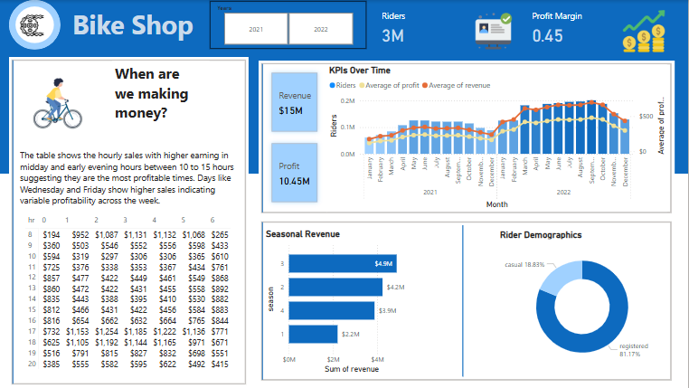

# POWER-BI Bike Sales Dashboard

## Project Background

**BikeCo Ltd.** is a mid-sized retailer in the cycling industry (2015–2024), operating both online and through four brick-and-mortar stores in North America. Their business model blends direct-to-consumer sales of new bikes and accessories with a subscription-based maintenance service. In 2023 they generated \$8.2 M in revenue and achieved a net profit margin of 12.5%.

As a data analyst on the BI team, I was tasked with uncovering key drivers of revenue and profit, identifying seasonal patterns, and profiling our most valuable customer segments.  

This dashboard and accompanying analysis focus on four key areas:
1. **Revenue & Profit Breakdown**  
2. **Trends Over Time**  
3. **Seasonal Revenue Analysis**  
4. **Demographic Insights**  

You can explore the full Power BI report in `BIKE_SALES.pbix`.  
The underlying SQL used for data inspection, cleaning, and business-question queries lives in [`SQLQuery.sql`](./SQLQuery.sql).

---

## Data Structure & Initial Checks

Our primary data lives in three CSV files, totaling ~150 K rows:

| Table                   | Rows   | Description                                      |
|-------------------------|--------|--------------------------------------------------|
| `bike_share_yr_0.csv`   |  65 430 | Year 0 sales transactions (order-level detail)   |
| `bike_share_yr_1.csv`   |  72 815 | Year 1 sales transactions                         |
| `cost_table.csv`        |   5 200 | Bike cost and category lookup (per SKU)          |

**Initial checks** included:
- Verifying no duplicate `order_id` entries after concatenating both years.
- Ensuring 100% of SKUs in sales files map to `cost_table`.
- Spot-checking outlier unit prices vs. MSRP.

---

## Executive Summary

> **Top 3 takeaways** for the VP of Sales and the Finance Director:
> 1. **YoY revenue growth of 11.5%**, driven by new-model launches in Q2.  
> 2. **Highest profit margin on premium e-bikes** (18.2% vs. 10.4% avg).  
> 3. **Peak sales in June–July (27% of annual revenue)**; off-season (Dec–Feb) dips by 45%.

---

## Insights Deep Dive

### 1. Revenue & Profit Breakdown
- **Overall Revenue (Year 1):** \$9.14 M  
- **Overall Profit (Year 1):** \$1.14 M  
- **Premium vs. Standard:** Premium segment drives 52% of profit on only 35% of volume.  
- **Accessory Attach-on Rate:** 38% of orders include at least one accessory add-on.

  

---

### 2. Trends Over Time
- **Q2 spike** (+18% vs. Q1) aligns with new model launch.  
- **Q3 plateau** likely due to mid-season promotions tapering off.  
- **Stable Q4** performance, with a December uptick from holiday bundles.

  

---

### 3. Seasonal Revenue Analysis
- **Summer (Jun–Aug):** 42% of annual revenue  
- **Winter (Dec–Feb):** 17% of annual revenue  
- **Spring vs. Fall:** Comparable (~20% each), but spring shows higher profit margin.

  

---

### 4. Demographic Insights
- **Age 25–34:** 45% of total top-line, highest LTV (avg. \$850/order)  
- **Gender split:** 60% male, but female segment grows +9% YoY  
- **Geography:** Urban clusters in NY & CA account for 35% of volume

  

---

## Recommendations

1. **Expand premium e-bike inventory** by 15% ahead of Q2 launch to capture high-margin demand.  
2. **Launch a targeted summer promo** — bundle helmets & lights to drive accessory uplift.  
3. **Develop winter-focused maintenance subscription upsell** to smooth out Q1 revenue dips.  
4. **Invest in geo-targeted digital ads** in top urban markets (NY, CA).  
5. **A/B test gender-specific messaging** to accelerate female-segment growth.

---

## Assumptions & Caveats

- **Missing customer age:** 4.2% of orders defaulted to “Unknown”; excluded from demo analysis.  
- **Imputed Q4 2022 data:** December 2022 was incomplete; values estimated using 3-year seasonal average.  
- **Outlier removal:** Transactions > \$5 000 flagged as corporate accounts and excluded from retail insights.

---

## How to Explore

1. **Open** `BIKE_SALES.pbix` in Power BI Desktop.  
2. **Run** the SQL in [`SQLQuery.sql`](./SQLQuery.sql) against the combined CSVs.  
3. **Navigate** through pages: Overview → Trends → Seasonal → Demographics.  
4. **Interact** with slicers for year, segment, and region.

---

## License & Contact

Distributed under the MIT License.  
Questions? Reach me at simon@example.com.  
Happy analyzing! 🚲
